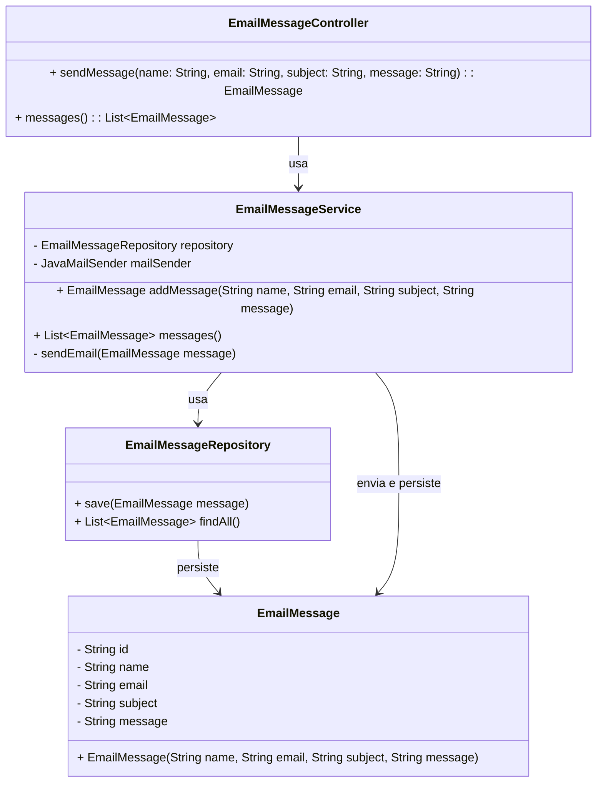

# Portfolio API

## Descrição

A **Portfolio API** é uma aplicação backend desenvolvida para gerenciar o envio de e-mails automáticos através do site pessoal de Vitor Souza, utilizando **GraphQL** para exposição dos endpoints.

## Tecnologias

- **Java 17**: Linguagem de programação utilizada.
- **Spring Boot**: Framework para desenvolvimento de aplicações.
- **Spring Data MongoDB**: Integração com o banco **MongoDB** para persistência.
- **GraphQL**: API para consulta e manipulação de dados.
- **GraphiQL**: Interface para testar endpoints GraphQL.
- **Docker**: Gerenciamento de contêineres.
- **Maven**: Ferramenta de automação de compilação.

## Funcionalidades

- **Envio de E-mails Automáticos** via Gmail.
- **Consulta e criação de mensagens com GraphQL**.
- **Testes de endpoints utilizando GraphiQL**.

## Diagrama de Classes (Domínio da API)


## Testes

 API está disponível em produção no seguinte endereço:

🔗 **https\://portfolio-api-ktaf.onrender.com/graphql**

### Exemplos de Queries GraphQL

#### Enviar Mensagem

```graphql
mutation {
  sendMessage(name: "Vítor", email: "vitor@email.com", subject: "Teste", message: "Olá, esta é uma mensagem de teste!") {
    id
    name
    email
    subject
    message
  }
}
```

#### Buscar Mensagens

```graphql
query {
  messages {
    id
    name
    email
    subject
    message
  }
}
```

## Contribuição

Contribuições são bem-vindas! Siga os passos abaixo:

1. Fork o repositório.
2. Crie uma nova branch (git checkout -b feature/nova-feature).
3. Commit suas alterações (git commit -m 'Adiciona nova feature').
4. Push para a branch (git push origin feature/nova-feature).
5. Abra um Pull Request.


